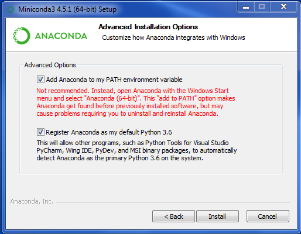
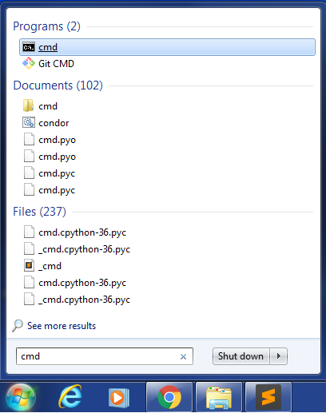
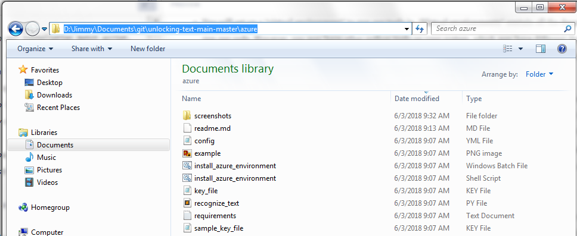
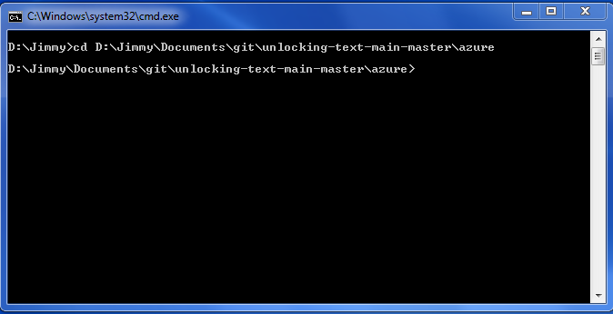
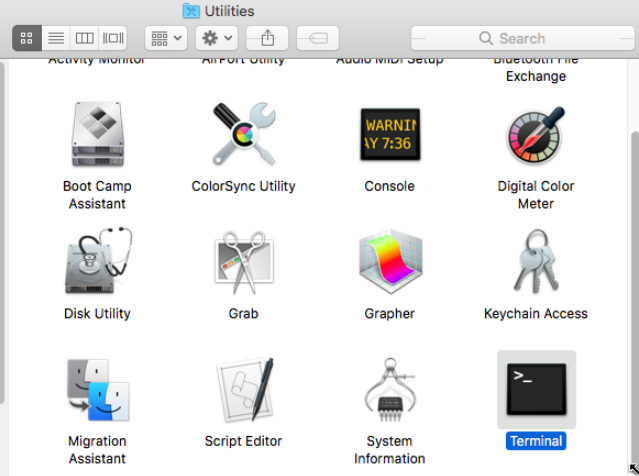
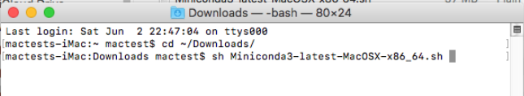
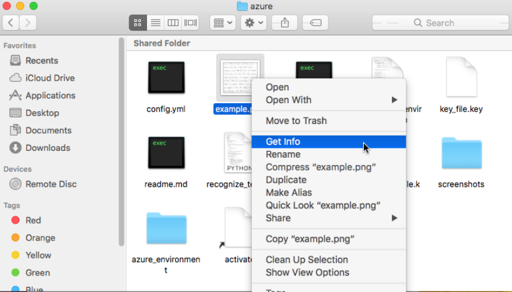
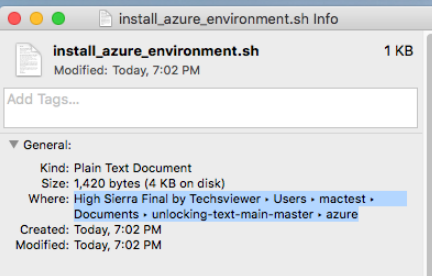
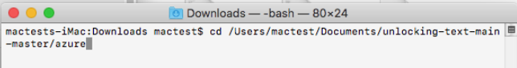

# Wrapper to do Handwriting Recognition (and also regular OCR) by calling the Microsoft Azure Cognitive Services API.
---
## User Guide
The `recognize_text.py` script will read in a locally stored image, present it to the Microsoft Azure Computer Vision to do handwriting recognition on it, and retrieve and return the result.  It can also be used to do optical character recognition on typewritten text.  The Microsoft Azure handwriting recognizer is a web-based service.  The script will send your image over the web to the recognizer, the recognizer will process your image and extract the text from it, and then the script will retrieve the recognition results.  See [Usage](#Usage) below for details.
* Images must be less then 4MB and smaller than 3200 pixes x 3200 pixels, in JPEG, PNG, GIF, or BMP formats.
* For handwriting recognition, you'll get 2 output files:
  * A `.recognized.txt` file that has the recognized text
  * An `.annotated.png` file that will consist of the input image with the recognized text superimposed upon it
* For OCR, only the `.recognized.txt` file is output.


### Pre-requisities:
1.  You'll need a subscription key for the "Computer Vision API" key from Microsoft.  At the time of this writing, there is a free version that will get you 5000 transactions per month and allow you a transaction rate of 20 transactions per minute.  There is a paid version for $2.50 per 1000 transactions with a transaction rate of 10 transactions per second.  If you are a student, or have a `.edu` e-mail address, it would be most advantageous to get a student subscription [here](https://azure.microsoft.com/en-us/free/students/).  It will give you $100 in credit, which is plenty to run the recognition software on a host of documents, at a rate of 10 transactions per second!  Additionally, when the credit is exhausted, you can still recognize documents at the 20-transactions-per-minute rate.  If you are not a student, obtain either a free or paid subscription key [here](https://docs.microsoft.com/en-us/azure/cognitive-services/computer-vision/vision-api-how-to-topics/howtosubscribe). 

2.  When you get the subscription key, it will be for a particular region, with a particular URL that has to go into the `config.yml` file.  Have a look at the `config.yml` file for an example.  The URL will be something like `https://<YOUR REGION HERE>.api.cognitive.microsoft.com/vision/v1.0/RecognizeText`

3.  The subscription key itself should go in a file, `key_file.key`.  See the `key_file.key` file that has been provided in this repository for an example.  The path to the key file should also appear in the `config.yml`.  If you run the script directly from your local copy of this repository (see installation instructions below), then it will not be necessary to change the path in the `config.yml`.  However, if you intend to run the script from elsewhere, then it will be necessary for the full path to the key file to appear in `config.yml`.  See `config.yml` itself for an example.


### Installation Instructions
1.  The easiest way to use these tools is to simply download this repository as a zip file and unzip it (although experienced git users may find it more convenient to clone it.)  To download the repository, [from our main page](https://github.com/Linguistics575/unlocking-text-main), look for the green button that says "clone or download" and click it.  Then cick, "download zip" as shown:

After downloading the zip file, you will have to unzip the folder, which on most platform is initiated simply by double-clicking it and moving the folder within (called `unlocking-text-main-master` to some convenient location, such as your documents folder for example.
1. Our tools are written in Python3; therefore, you will need to have Python3 installed on your computer.  For experienced pythonistas, simply setup a python3 environment using the `requirements.txt` file and proceed to the [Usage](#usage) section.  For everyone else, read the remaining installation instructions for your platform: [Windows](#remaining-instructions-for-windows-users), or [Linux and Mac](#remaining-instructions-for-linux-and-mac-users).

 #### Remaining instructions for Windows users
 *  You will set up a "virtual environment" to run our tools in.  "Virtual environments" contain all the dependencies and packages required to run our code.  However, you may have other python tools on your system, which may have different dependencies, which may even conflict with those needed here.  To avoid these troubles, you will set up a "virtual environment" for our tools, which must be activated.  This will keep the azure environment separate from the environments you may otherwise need.  
1. If you already have python3 on your system, or if you are unsure if you do, you may run our installation batch script, which will check to see if you have python3, and give you an error message if you do not.  (See step 2 below.)   If you do not have python3 on your system, you will have to install it.  We recommend the `Miniconda` python distribution.  Download and install the Python 3.6 version of `Miniconda` [here](https://conda.io/miniconda.html) by downloading the appropriate `.exe` (most likely the 64-bit exe installer for windows) and running it.  When you get to the "Advanced Options" screen, we *do* recommend clicking both boxes, even the one to "Add Anaconda to my PATH environment variable" as shown below.

This will allow you to run our tools from the windows command line.  However, you may choose not to do this.  If that is the case, you will have to launch the "Anaconda Prompt" from the start menu whenever these instructions say to "launch/open a command line terminal."
2. To run our installation batch script, you will have to open a command terminal in the `azure` working directory.
    * Here is how to do open a command line terminal in the `azure working directory`:
    1. In the search bar on the start menu, type `cmd`.  You should see something like this:
    
    2. Click it to launch.  (Or, if you did not add Anaconda to your path, search for and launch the Anaconda Prompt and follow the rest of these instructions.)
    3. Now we have to get to the `azure` working directory.  The easiest way is to copy the path from the address bar in windows explorer to the clipboard.  In Windows Explorer, navigate to the location to which you unzipped the repository, and within that repository, double-click the `azure` folder.
    4. Click within the address bar at the top of the screen to show the path, and hit `ctrl+c` to copy it.  It should look something like this:
    
    5. Go back to the command terminal and click anywhere in the window.  Then type `cd`, a space, then right-click anywhere in the window, and select `paste`.  (Unfortunately, `ctrl+v` will not work in the terminal.)  Then hit enter.  You should now see something that looks like this:
    
3. In the cmd window, type `install_azure_environment.bat`, and hit `Enter.`  If python3 is installed, you will see various messages scroll across the screen as the dependencies for the recognizer are installed.  This may take several minutes, and at times, the screen may appear to hang, as if if nothing is happening at all.  Within a few minutes, however, things should get moving again.  If all goes well, the last thing you see should be a message saying that the installation was successful, and the following instructions:
            * `To begin using the azure environment, type "activate".`
            * `When you are finished, type "deactivate" `
4. to begin using the azure environment, you will have to "activate" it as per the instructions you have just seen.   You are now ready to submit an image containing handwritten text to the Azure recognizer as in the [Usage](#usage) section below.  When you are finished, you can type "deactivate," or simply close the cmd window.

#### Remaining instructions for Linux and Mac users
* Note: The explicit paths mentioned these instructions are for Mac users.  Linux users should have no trouble adjusting as appropriate.
*  You will set up a "virtual environment" to run our tools in.  "Virtual environments" contain all the dependencies and packages required to run our code.  However, you may have other python tools on your system, which may have different dependencies, which may even conflict with those needed here.  To avoid these troubles, you will set up a "virtual environment" for our tools, which must be activated.  This will keep the azure environment separate from the environments you may otherwise need.  
1. If you already have python3 on your system, or if you are unsure if you do, you may run our installation shell script, which will check to see if you have python3, and give you an error message if you do not.  (See step 2 below.)   If you do not have python3 on your system, you will have to install it.  We recommend the `Miniconda` python distribution.  Download and install the Python 3.6 version of `Miniconda`.
    * Here is how to do that:
    1. Download the 64-bit bash installer [here](https://conda.io/miniconda.html).
    2. To run the installer, you will have to issue a command in the terminal, so you will have to launch a terminal session.  From the Finder, select `Go`, then `Utilities`. Finally, double click `Terminal` as shown:

    3. In the terminal window, type `cd ~/Downloads` and hit enter onto navigate to the `Downloads` directory.
    4. type `sh Miniconda3-latest-macOSX-86_64.sh` (the name of the of file you just downloaded) and hit enter, as shown below.  (You can save yourself some typing by using tab completion.  Start typing just the beginning -- say, `sh Minicon` and then hit the tab key.)  

This will begin the process of installing python3 on your system.  Hit enter several times to scroll through the license agreement, and finally type `yes` to accept it.  Press enter to confirm the location when asked.  The terminal may appear to hang for a moment, but do not worry.  It should start moving along shortly.  You see a message `Do you wish the installer to prepend the Miniconda3 install location to PATH in your /Users/<user name>/.bash_profile?`  Type `yes`.  Quit the terminal.

2. To run our install script to set up a virtual environment and install the dependencies necessary for our tools, you will need to launch a new terminal session and navigate to the `azure directory`.
    * Here is the easiest way to do that:
    1. Navigate to where you placed the `unlocking-text-main-master` directory in a Finder window, double-click `azure` to open it, then right-click any file in the folder and select "Get Info", as shown below:
    
    2. Towards the top of the "Get Info" window, look for "Where" (as highlighted below), highlight it, right-click, and select `copy` to copy the path to the clipboard.
    
    3. Launch a new terminal window as described above.  Then type `cd`,  a space, then right-click anywhere in the window, and select `paste`, and hit enter.  You should now see something that looks like this:
    
2. Type `./install_azure_environment.sh` on the command line and hit `enter`.  (Recall that you can use tab completion to save typing.)  You will see various messages scroll across the screen as the dependencies for the recognizer are installed.  This may take several minutes, and at times, the screen may appear to hang, as if if nothing is happening at all.  Within a few minutes, however, things should get moving again.  If all goes well, the last thing you see should be a message saying that the setup of the environment is complete, and the following instructions:
            * `To activate environment, type "source activate"`
            * `to deactivate, type "deactivate"`
            * `When you are finished, type "deactivate"`
4. to begin using the azure environment, type "source activate" as per the instructions.   You are now ready to submit an image containing handwritten text to the Azure recognizer as in the [Usage](#usage) section below.  When you are finished, you can type "deactivate," or simply close the terminal.  

### Usage
To use these tools, you must first activate the azure environment.  Open a command terminal window, navigate to the azure directory (as described in the installation instructions above) and activate the environment:
 * Windows users, simply type `activate`.
 * Mac and Linux users, type, `source activate`.

You can run the Handwriting recognizer on a single image, or on a file containing the paths to as many images as you like.  A sample image, `example.png` has been provided for you in this directory for testing.

The form of the command will be:
`python recognize_text.py config_file (-i INPUT_IMAGE | -f FILE_OF_INPUT_PATHS) [-o OUTPUT_DIRECTORY] [--ocr]`
* `config_file` is the config file containing the API URL and the path to the file containing your subscription key.
* To run recognition on a single image, the next thing to type would be `-i INPUT_IMAGE`, or, to run a batch of images, it would be `-f FILE_OF_INPUT_PATHS`.
* If you'd like the output to go anywhere other than the current directory you can add `-o OUTPUT_DIRECTORY`, or just leave it out for the current directory.
* If you'd like to run optical character recognition for typewritten text as opposed to handwriting, additionally type `--ocr`. 

#### Examples:
* for Handwriting recognition for a single file:
   * `python recognize_text.py config.yml -i my_image_file.png [-o my_output_directory]`
* for Handwriting recognition for a batch of files:
   * `python recognize_text.py config.yml -f file_with_a_list_paths.txt [-o my_output_directory]`
* for OCR recognition (of printed, typewritten text) for a single file:
   * `python recognize_text.py config.yml -i my_image_file.png [-o my_output_directory] --ocr` 
* for OCR recognition (of printed, typewritten text) for a batch of files:
   * `python recognize_text.py config.yml -f file_with_a_list_paths.txt [-o my_output_directory] --ocr`

---
## Technical Documentation
`recognize_text.py` is truly very simple.  It sends a POST request to the Microsoft API that contains the image data along with the subscription key and url as retrieved from `config.yml`  It then probes the url returned from the request until the recognition result is ready, and retrieves the result as returned in json format.  The json contains bounding box locations as well as the recognized text.  This information is used to created a pyplot image of the original image with the bounding boxes and recognized text superimposed upon it (the `.annotated.png` output file).  All functions have been thoroughly documented.

## License

```
MIT License

Copyright (c) [2018] [James V. Bruno]

Permission is hereby granted, free of charge, to any person obtaining a copy
of this software and associated documentation files (the "Software"), to deal
in the Software without restriction, including without limitation the rights
to use, copy, modify, merge, publish, distribute, sublicense, and/or sell
copies of the Software, and to permit persons to whom the Software is
furnished to do so, subject to the following conditions:

The above copyright notice and this permission notice shall be included in all
copies or substantial portions of the Software.

THE SOFTWARE IS PROVIDED "AS IS", WITHOUT WARRANTY OF ANY KIND, EXPRESS OR
IMPLIED, INCLUDING BUT NOT LIMITED TO THE WARRANTIES OF MERCHANTABILITY,
FITNESS FOR A PARTICULAR PURPOSE AND NONINFRINGEMENT. IN NO EVENT SHALL THE
AUTHORS OR COPYRIGHT HOLDERS BE LIABLE FOR ANY CLAIM, DAMAGES OR OTHER
LIABILITY, WHETHER IN AN ACTION OF CONTRACT, TORT OR OTHERWISE, ARISING FROM,
OUT OF OR IN CONNECTION WITH THE SOFTWARE OR THE USE OR OTHER DEALINGS IN THE
SOFTWARE.```